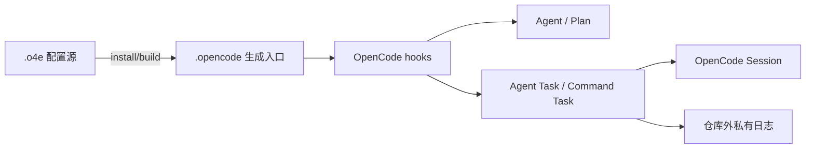

# O4E 当前特性总览

[中文](features.cn.md) | [English](features.md)

> 本文描述当前仓库实现的公开行为，并把它与 OpenCode 宿主提供的原生能力分开说明。公开验证基线为 OpenCode `>=1.18.21`；下文具体验收记录使用 `1.18.31`，不表示范围内所有版本均已验证。实现、Schema 和当前测试是事实来源；原生对比保留对应宿主版本或源码提交，未验证的版本和目标平台不写成已通过。

## 这份文档回答什么

- O4E 在 OpenCode 之上增加了哪些 Agent、命令、Workflow 和恢复能力？
- 一次委派或 Bash 调用从模型到宿主经过哪些边界？
- 哪些行为是 O4E 的约定，哪些仍由 OpenCode 决定？

## 组件边界

O4E 是 OpenCode 插件，不是独立 Agent 服务。用户编辑 `.o4e/`，安装器校验配置并生成 `.opencode/` 运行时；插件随后通过 OpenCode hooks、Session、`context.ask` 和原生提示工作。



`.o4e/` 是可编辑真实源；`.opencode/` 是生成物，不应手工维护。O4E 不提供独立 Agent 进程、HTTP/SSE Gateway、跨主机 A2A 网络或跨 OpenCode 进程的任务协调。

## 能力矩阵

| 能力 | O4E 当前行为 | 由谁决定 |
| --- | --- | --- |
| Agent 角色 | `all`、`primary`、`subagent` 和宿主固定 `system` 四类目录契约 | O4E Schema、构建器 |
| Plan | 所有 Profile 使用 `<name> (plan)`；`self` 只生成 Profile，`child` 另保留源 Agent；默认只读交集 | O4E 配置与权限 |
| 原生 Agent | `build`、`plan`、`general`、`explore` 各自 `keep`、`managed` 或 `disable` | O4E 配置投影，宿主负责加载 |
| 普通委派 | 同名受管 `task` 是唯一 Agent 委派入口，默认后台运行 | O4E Runtime + 宿主 Session |
| Task 管理 | `o4e_task` 提供 `status/watch/inspect/output/cancel/pending`，Agent 另有 `input/resolve/resume` | O4E Runtime |
| 命令执行 | 同名受管 `bash` 接管 OpenCode Host Shell，建立 Command Task | O4E Command Runtime + 宿主权限 |
| Workflow（Beta） | 实验性主会话检查点、StepReport 和 Gate；默认关闭，仅 `enableWorkflow: true` 显式试用，不宣称生产可用 | O4E Workflow Runtime |
| Skill / Soul | Skill 按 Agent 白名单加载；Soul 可合并全局和项目内容 | O4E 构建器和 hooks |
| 权限 | O4E 策略收紧边界，最终仍经过宿主 `context.ask` | O4E + OpenCode |

## Agent 与委派

### Agent 类型与深度

- `all` 可以被用户选择，也可以作为委派目标。
- `primary` 只能作为主 Agent。
- `subagent` 只能作为受管委派目标。
- `system` 只保留宿主固定的 `compaction`、`title` 和 `summary` 阶段。

`maxDelegationDepth` 是全局上限，默认 `2`，只允许 `1..5`。根 Agent 深度为 0，每次显式 Agent `task` 增加 1。Workflow Step 在当前主 Session 执行，本身不增加深度；若 Step 要求 Task，主 Agent 仍按普通委派独立授权并增加 1。达到上限时应直接处理或向父 Agent 报告，不能由单个任务参数绕过。提高上限会增加任务数量、模型成本和协调复杂度，通常不建议这样做。

每次合法委派都要先通过 O4E 规则和宿主 `context.ask`，再创建 child Session。子 Agent 可以管理自己创建的下一层 Task，但不能管理父 Task 或兄弟 Task。权限 Overlay 只能收紧祖先权限，不能扩权；Task 的 Effect 和 Scope 也沿父链受限。

### 前台和后台

普通 `task` 省略 `background` 时立即创建后台 Agent Task 并返回稳定 `taskID`。只有用户明确要求同步或前台委派时才设置 `background: false`。后台 Task 的结果不直接塞进每一次 watch；使用 `output` 读取正文。

后台 Agent 的结果通过 OpenCode Session Message/Part 持久化引用读取。终态回执采用至少一次投递，消费方按 `receiptID` 去重；回执只确认状态，不替代正文。

### 输入、恢复和 steer

`o4e_task input` 默认把输入持久化到同一 child Session 的下一次 turn，携带 `expectedRevision` 做 CAS。输入上限为 16,384 个 UTF-16 code unit，queue 和 steer 使用同一截断规则。

`delivery: "steer"` 请求宿主把输入持久化并安排到下一次可运行回合。只有宿主返回有效 admission（包括匹配的 `id`，可选 `sessionID` 必须匹配）才报告 `inputDelivery.mode: "steer"`；这不承诺立即打断当前模型 token。宿主不支持、响应无效或请求未确认时，Runtime 会重试同一 message ID，随后转入 durable queue 并给出 `steer-admission-unconfirmed` 诊断。进程恢复时仍会用稳定 ID 重试已持久化的 steer 标记。

`resume` 只唤醒可安全重派发的 `queued/retry/pending-input` Task；`unknown`、取消中的执行不会被重启。reader abort 只结束读取等待，不取消 Task。显式取消、owner 删除、disposal、受管 child 生命周期终止和 execution timeout 仍会触发停止；停止或持久化未确认时保留保守锁和 admission。

Agent Task 的所有模型错误都会保留原因并进入 `waiting_retry_decision`，包括非 `APIError`
和宿主标记不可重试的错误。O4E 不自动重试模型，也不自动切换 `fallbackModels`；主 Agent
使用最新 revision 显式选择 `resolve continue|restart|stop`。候选与分类只作诊断，显式继续/
重启仍受授权、CAS、取消、Attempt、Scope Lock 和副作用边界约束。宿主 provider 内部重试
不经过插件控制。

## Bash 与 Command Task

### 执行方式

受管 `bash` 必填 `command` 和 `description`，可选 `workdir`、`timeout`。默认使用当前 Session `directory`，每次调用互不继承 cwd。执行使用 OpenCode `config.shell` 选择的 Host Shell，按目标 Shell 的参数协议启动，无 PTY、stdin EOF，并继承启动环境。O4E 不把命令转换为另一种 Shell 语法；具体 Shell 语义由 OpenCode 和目标平台决定。

权限解析只提取可可靠识别的资源，不对白名单语法做限制；命令原文交给目标 Host Shell，因此由目标 Shell 处理引号、展开、赋值、循环、函数、脚本和重定向。静态可确定的路径会交给宿主权限检查，动态路径不会被猜测展开；这些检查不是 sandbox。

Bash 不获取、借用或恢复执行 Scope Lock，不与可写 Agent 或其他 Bash 因写范围互斥。Command Task 使用独立的 owner/kind lane 和 `maxConcurrentCommands`（默认 4），不占 Agent 并发槽；并发修改同一文件和命令依赖顺序由调用方协调。Command ledger 和 owner index 在 claim 后持久化、执行前确认；进程重载只重接同一进程内仍存在的 handle，不跨宿主重启收养 PID，也不重执行旧 claim。Agent 的 Effect 推导与 Agent 之间的写锁不变。

### 等待窗口与状态管理

| 窗口 | 默认值 | 作用 |
| --- | ---: | --- |
| admission wait | 1,000 ms | 等待进入执行队列 |
| running wait | 10,000 ms | 开始运行后等待直接结果 |
| execution timeout | 120,000 ms | 命令本身的停止上限 |
| watch window | 1,800,000 ms | 默认 30 分钟，最大 1 小时 |

前两个窗口与 execution timeout、授权和持久化耗时独立。窗口到期而命令仍 queued/running 时，Bash 返回稳定 `taskID` 快照，命令继续执行。之后使用 `o4e_task status/watch/inspect/output/cancel` 管理；Command 不支持 `input`、模型 fallback 或 Agent receipt。

默认 `watch` 在调用入口冻结 owner 当时的 Agent 和 Command Task 集合。省略 selector 表示全部两类，`taskIDs: []` 表示空集，显式列表可以混合两类。任一新的终态或需处理事件出现即返回；已可靠交付的事件不会重复唤醒。watch/status 只返回状态，output 才返回正文；一次事件不表示整个集合或依赖链已经完成。

主 Session 的后台协调还有一层插件生命周期接线：真实用户插话先执行，不会隐式取消 Agent/Command Task；主 Agent 可先完成不依赖后台结果的工作。宿主将该回合自然结算为 idle 后，若跟踪已启用且仍有未完成 Task，O4E 可提交一个 Runtime 生成的 synthetic 文本回合恢复协调。它不是模型伪造的 `tool` Part，也不会绕过宿主权限询问或自动回答子任务 permission/question。宿主根回合 abort 只临时抑制自动续接并保留已脱离的后台执行，下一条真实用户消息解除该临时抑制；显式 `o4e_task action:follow enabled:false` 则持久停用，不被普通消息解除。显式 Task cancel、owner 删除、受管 child 终止和插件 dispose 仍会停止相应执行。详见[自动跟踪](../reference/automatic-follow.cn.md)。

## 输出、日志与可视性

### 模型看到的内容

普通成功且未截断的 Bash 直接返回捕获文本，保留空格、换行和空输出，不添加 Task 包装、摘要或重排。非零退出、异常、截断和日志不完整会以明确分隔的最短控制信息出现在模型正文中。

“原样”只表示各流按 UTF-8 解码后依照回调观察顺序捕获的文本，不承诺终端仿真、二进制保真或两个独立 stdout/stderr fd 的真实全局写入顺序。

| 层 | 当前预算和语义 |
| --- | --- |
| Execution view | 内存最多 64 KiB；运行中保留 tail，大型终态使用 head + tail |
| Bash model body | 独立 48 KiB 和 1,800 行预算；超限返回 tail 并先给控制信息 |
| `o4eResult` metadata | Bash 20 KiB，其他 Command 动作 40 KiB |
| Host tool result | 49 KiB 文本/结构化结果预算；watch 超限在确认前拒绝，本次不确认新回执，也不回滚先前确认 |
| Native Shell card | 独立累积最多 256 MiB，后台脱离后继续 best-effort 更新 |
| Private log | 仓库外、目录 0700、文件 0600，单条最多 256 MiB |

完整日志在终态结算前确认写入；捕获、写盘、容量、同步失败都会标记 archive incomplete，不能冒充完整存档。日志从终态结算起按 24 小时惰性清理，活动日志不会删除。需要完整文本时，模型应使用获准的宿主文件工具按 `logPath` 分段读取；不能假定 UI metadata 或 JSON attachment 自动可读。

`inspect` 只读取保留的过程预览，支持 cursor、forward/backward、分页和可信 resume。最新 tail 随输出增长，过程读取不表示完成；前缀变化、截断或不可验证历史会返回 `gap`/`unavailable`。

## Workflow

Workflow 定义位于 `.o4e/workflows/*.jsonc`，只接受 `contract: "process-v1"` 和 `type: "work"` Step。依赖通过 `dependsOn`，输入输出使用受限 JSON Pointer 引用。普通 Step 由当前主 Agent 执行；`execution.mode: "task"` 只要求主 Agent 另行调用现有 `task`，不会兑换 Task 授权。Gate 检查 Output Schema、Artifact 数量和 `command-success`、`task-created`、`task-result` 三种有限事实引用。嵌套、Loop、并行主 Step 和主 Session Effect/Scope 隔离声明当前拒绝。

`o4e_workflow` 使用显式 `catalog/list/start/read/begin/report/resume/pause/stop` action。`list` 提供当前 owner 同 Agent 的有权 Run 摘要，TUI 另提供只读检查点面板。Run 保存在 owner Session 的 `metadata.o4e.workflowProcess`，不创建后台 Workflow ledger、taskID 或执行 Session，也不进入 `o4e_task` 管理面。消息 hook 只中断当前活动 Run；恢复前必须处理最新用户指令。已有自动化 process 回归，以及 Linux / OpenCode 1.18.31 / 真实模型的单步 task-created/task-result Gate、report/read/list 正向验收；三类证据完整矩阵、多用户回合、compaction、重启、授权 UI 和 Windows/macOS 尚未完整验收。

## 安装与配置入口

```bash
npm ci
node scripts/installer.mjs install --no-tui --target /path/to/project
cd /path/to/project
opencode
```

主要配置在 `.o4e/config.jsonc`：

| 字段 | 默认值 | 作用 |
| --- | --- | --- |
| `nativeAgents` | 四项 `disable`（默认安装预设 `o4e-only`） | 控制宿主 `build/plan/general/explore`；选择其他预设时按该预设物化 |
| `backgroundTasks.maxRetries` | `1` | Agent 显式 retry round |
| `backgroundTasks.maxConcurrentAgents` | `4` | 每个 owner 的 Agent 并发槽 |
| `backgroundTasks.maxConcurrentCommands` | `4` | 每个 owner 的 Command 并发槽 |
| `maxDelegationDepth` | `2` | Agent 委派最大深度，允许 `1..5` |
| `loadTools` | `null` | 默认工具权限白名单 |
| `loadSkills` | `['*']` | 默认允许加载所有已发现 Skill；O4E 受管默认 Skill registry 当前包含两个 Skill |
| `permission.external_directory` | `allow` | 默认目录读取门 |

仓库默认资产包含 `orchestrator` all Agent（并生成 `orchestrator (plan)`）、`chat` primary、5 个专业 subagent 源配置、`build/plan` native profiles、`general/explore` subagent profiles，以及 2 个受管 Skill（`o4e-agent-creator`、`o4e-workflow-creator`）。专业角色展开为普通 `architect` 加只读 `architect (plan)`、仅 Plan 的 `researcher (plan)`/`reviewer (plan)`，以及普通 `debugger`/`tester`；它们都保持 subagent，不进入主选择器。交互安装器分别选择主 Agent 与子 Agent。默认 `o4e-only` 预设会禁用四个宿主原生 Agent；选择 `managed` 或 `keep` 才会按对应策略接管或保留它们。具体选择以目标 `.o4e/config.jsonc` 为准。

CLI 当前只接受显式子命令 `install/uninstall/status/build/export/import`。当前版本是第一且唯一版本：不提供历史配置迁移、旧 ledger 读取、字段回填或隐式升级。无效或不可验证记录直接 fail closed。

## 与 OpenCode 原生行为的对比

| 主题 | OpenCode 原生 | O4E 增加或改变的行为 |
| --- | --- | --- |
| Agent 配置 | 宿主提供 Agent、Session、模型和工具生命周期 | `.o4e` 提供角色目录、Prompt、Skill、Soul、原生 Agent 三态投影 |
| `task` | 宿主 builtin task 负责原生子 Agent 调用和权限流程 | 同名受管 adapter 成为唯一委派入口，默认后台、稳定 `taskID`、深度和父链约束 |
| `bash` | 宿主提供普通 Shell 工具、权限和 Shell 卡片 | 受管 Bash 直接进入 Command Runtime，增加 owner ledger、资源并发上限、独立等待窗口、tail/日志和取消边界，不增加执行写锁 |
| Session | 宿主保存消息、Parts、busy/idle 和原生 permission/question | O4E 在 Session metadata 中保存 Agent/Command Task ledger；Workflow 只保存 owner 检查点，不建后台 ledger |
| 权限 | 宿主 `allow/ask/deny` 与 `context.ask` 是最终执行门 | O4E 先做角色、目标、Overlay、Effect/Scope 和 owner 校验，再请求宿主确认；O4E 不用 `allow` 绕过宿主 `ask` |
| 输出 | 宿主负责 Tool Part、Shell 卡片和模型响应展示，可能折叠或裁剪 | O4E 保留捕获文本、明示退出/截断/日志不完整，并把 `watch/status` 与 `output` 分离 |
| 交互输入 | 宿主 prompt API 接受消息和 delivery 选项 | O4E 默认 durable next-turn；`steer` 只有宿主确认 admission 才报告成功，不承诺即时 token 中断 |
| 观察等待 | 宿主提供 Session 状态和事件 | O4E 提供 owner 冻结集合、终态/可操作事件唤醒、receipt 去重及可中断 watch |
| Workflow | 宿主没有 O4E 的 process-v1 检查点与 Gate 契约 | O4E 在当前主 Session 验证并持久化 Step 检查点，实际工具和 Task 仍由主 Agent 显式执行 |
| 跨进程 | 宿主与单个 OpenCode 进程关联 | O4E 的 scheduler、Scope Lock 和 Runtime 也只在单个进程内有效 |

### 不能从对比表推断的内容

- O4E 不替换宿主的模型、权限数据库、TUI 渲染或 Shell 实现。
- 宿主 Shell 卡片的折叠、trim、ANSI 处理和中间 TUI 可见性不由 O4E 保证。
- `steer` 的“admitted”是宿主持久化接纳，不代表当前 token 已停止；网络响应丢失仍按至少一次语义处理。
- OpenCode 的具体 API/event 形状随宿主版本变化；本文只描述当前 adapter 能验证的字段，不承诺未测试版本的兼容。
- O4E 的 Task 状态、receipt、日志和锁不是 OS sandbox，也不保证停止通过 `setsid`/`setpgid` 逃逸的后代进程。

### 原生行为的历史对比基线

以下内容是明确标注的 OpenCode `v1.18.23` 历史源码对比，不是当前宿主版本的行为保证。当前 O4E 行为、当前本地宿主和目标平台验证证据应以本节前面的说明及测试为准。

以 OpenCode `v1.18.23` 源码为基线时，原生 `task` 默认前台等待，响应带有 XML-like 的 Task 状态包装；`background` 是宿主侧的异步选项。该基线中的原生 `bash` 默认约 2 分钟超时，输出按约 50 KiB/2,000 行截断并写宿主 truncation 文件，空输出会显示 `(no output)`；调用者 abort 或超时会停止 Shell。原生 child Session 的宿主 `parentID` 直接指向调用 Session，并由宿主 `subagent_depth`（默认 1）限制深度。以上是历史源码基线，不等同于当前所有宿主版本行为。

O4E 有意改变这些用户可见边界：普通 Agent `task` 默认后台并返回稳定 `taskID`；短 Bash 成功返回捕获文本本身，空输出保持空白；长 Bash 在独立 10 秒 running 窗口后脱离并继续运行，由 `o4e_task` 管理；输出、日志、owner/child 生命周期、Scope Lock、watch/inspect 和恢复由 O4E Runtime 承担。O4E 仍调用宿主权限和 Session API，不能替换宿主的最终权限判断、TUI 卡片或模型执行器。

OpenCode `v1.18.23` 的 PromptInput 类型尚未包含 `delivery`；当前 O4E adapter 使用较新宿主提供的 `/api/session/:id/prompt` admission 响应（`id`、`sessionID`、`admittedSeq` 等）来支持 `delivery: "steer"`。本地已核对较新 SDK 的响应类型，但没有把完整的较新服务端实现当作已验证事实。这表示宿主持久化接纳并安排下一次可运行回合，不表示旧宿主一定支持，也不表示当前 token 已立即停止。

## 证据与进一步阅读

- [快速开始](../getting-started/quick-start.cn.md)
- [项目概览](overview.cn.md)
- [配置参考](../reference/configuration.cn.md)
- [Agent 参考](../reference/agents.cn.md)
- [Workflow 参考](../reference/workflows.cn.md)
- [CLI 参考](../reference/cli.cn.md)
- `SPEC.md`：当前实现契约与验收证据
- `test/`：行为测试和宿主适配夹具

原生对比参考：[OpenCode v1.18.23 task.ts](https://github.com/anomalyco/opencode/blob/v1.18.23/packages/opencode/src/tool/task.ts)、[shell.ts](https://github.com/anomalyco/opencode/blob/v1.18.23/packages/opencode/src/tool/shell.ts) 和 [v1.18.30 SDK 的 SessionInputAdmitted 类型](https://github.com/anomalyco/opencode/blob/v1.18.30/packages/sdk/js/src/v2/gen/types.gen.ts)。当前本地宿主为 `1.18.31`；旧版本源码和 SDK 仅作为明确标注的对比证据。

本文不把未运行的模型交互、TUI 视觉效果或宿主未确认的 API 行为写成已验证能力。
