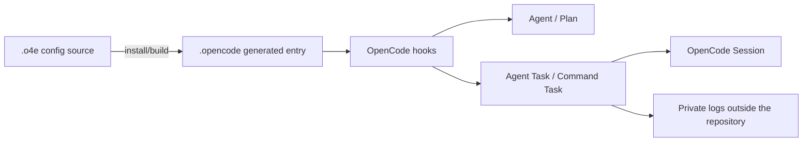

# O4E Current Feature Overview

[English](features.md) | [中文](features.cn.md)

> This document describes the public behavior implemented by the current repository and explains it separately from the native capabilities provided by the OpenCode host. The public verification baseline is OpenCode `>=1.18.21`; the specific acceptance records below used `1.18.31`, which does not mean every version in range has been verified. The implementation, Schemas, and current tests are the source of truth; native comparisons retain the corresponding host version or source commit, and unverified versions and target platforms are not claimed as passed.

## What This Document Answers

- Which Agent, command, Workflow, and recovery capabilities does O4E add on top of OpenCode?
- Which boundaries does a delegation or Bash call cross from the model to the host?
- Which behaviors are O4E conventions, and which are still decided by OpenCode?

## Component Boundaries

O4E is an OpenCode plugin, not a standalone Agent service. Users edit `.o4e/`; the installer validates the configuration and generates the `.opencode/` runtime; the plugin then works through OpenCode hooks, Sessions, `context.ask`, and native prompts.



`.o4e/` is the editable source of truth; `.opencode/` is generated output and should not be maintained by hand. O4E does not provide a standalone Agent process, an HTTP/SSE Gateway, a cross-host A2A network, or task coordination across OpenCode processes.

## Capability Matrix

| Capability | Current O4E behavior | Decided by |
| --- | --- | --- |
| Agent roles | Four directory contracts: `all`, `primary`, `subagent`, and host-fixed `system` | O4E Schema, builder |
| Plan | All Profiles use `<name> (plan)`; `self` generates only the Profile, `child` also keeps the source Agent; read-only intersection by default | O4E configuration and permissions |
| Native Agents | `build`, `plan`, `general`, `explore` each `keep`, `managed`, or `disable` | O4E configuration projection; the host loads them |
| Normal delegation | The same-named managed `task` is the sole Agent delegation entry and runs in the background by default | O4E Runtime + host Session |
| Task management | `o4e_task` provides `status/watch/inspect/output/cancel/pending`; Agents additionally have `input/resolve/resume` | O4E Runtime |
| Command execution | The same-named managed `bash` takes over the OpenCode Host Shell and creates Command Tasks | O4E Command Runtime + host permissions |
| Workflow (Beta) | Experimental main-session checkpoints, StepReports, and Gates; off by default, explicitly tried only via `enableWorkflow: true`, not claimed production-ready | O4E Workflow Runtime |
| Skill / Soul | Skills load per-Agent via allowlists; Soul can merge global and project content | O4E builder and hooks |
| Permissions | O4E policies tighten boundaries; the final gate still goes through the host `context.ask` | O4E + OpenCode |

## Agents and Delegation

### Agent Types and Depth

- `all` can be selected by the user and can also be a delegation target.
- `primary` can only serve as the main Agent.
- `subagent` can only serve as a managed delegation target.
- `system` retains only the host-fixed `compaction`, `title`, and `summary` stages.

`maxDelegationDepth` is a global cap, default `2`, allowing only `1..5`. The root Agent has depth 0, and each explicit Agent `task` adds 1. Workflow Steps execute in the current main Session and do not add depth themselves; if a Step requires a Task, the main Agent still authorizes it independently as a normal delegation and adds 1. When the cap is reached, handle the work directly or report to the parent Agent; a single task parameter cannot bypass it. Raising the cap increases task count, model cost, and coordination complexity, and is generally not recommended.

Every legitimate delegation must first pass O4E rules and the host `context.ask` before a child Session is created. A child Agent can manage the next-level Tasks it creates, but not parent or sibling Tasks. Permission Overlays can only tighten ancestor permissions, never expand them; a Task's Effect and Scope are likewise constrained along the parent chain.

### Foreground and Background

A normal `task` that omits `background` immediately creates a background Agent Task and returns a stable `taskID`. Set `background: false` only when the user explicitly requests synchronous or foreground delegation. Background Task results are not stuffed into every watch; use `output` to read the body.

Background Agent results are read through persisted OpenCode Session Message/Part references. Terminal receipts use at-least-once delivery, and consumers deduplicate by `receiptID`; a receipt only confirms status and does not replace the body.

### Input, Resume, and steer

`o4e_task input` by default persists input to the next turn of the same child Session, carrying `expectedRevision` for CAS. Input is limited to 16,384 UTF-16 code units; queue and steer use the same truncation rule.

`delivery: "steer"` asks the host to persist the input and schedule it for the next runnable turn. `inputDelivery.mode: "steer"` is reported only when the host returns a valid admission (including a matching `id`; the optional `sessionID` must also match); this does not promise immediate interruption of the current model token. When the host does not support it, the response is invalid, or the request is unconfirmed, the Runtime retries the same message ID and then falls back to the durable queue with a `steer-admission-unconfirmed` diagnostic. On process recovery, persisted steer markers are still retried with their stable IDs.

`resume` only wakes `queued/retry/pending-input` Tasks that can be safely redispatched; `unknown` or cancellation-in-flight executions are not restarted. A reader abort only ends the read wait and does not cancel the Task. Explicit cancellation, owner deletion, disposal, managed child lifecycle termination, and execution timeout still trigger a stop; when a stop or persistence is unconfirmed, conservative locks and admissions are retained.

All model errors of an Agent Task retain their cause and enter `waiting_retry_decision`, including non-`APIError`
errors and errors the host marks as non-retryable. O4E neither automatically retries the model nor automatically switches `fallbackModels`; the main Agent
uses the latest revision to explicitly choose `resolve continue|restart|stop`. Candidates and classification are diagnostic only; explicit continue/
restart remains subject to authorization, CAS, cancellation, Attempt, Scope Lock, and side-effect boundary constraints. Host provider-internal retries
do not pass through plugin control.

## Bash and Command Tasks

### Execution Model

The managed `bash` requires `command` and `description`, with optional `workdir` and `timeout`. It uses the current Session `directory` by default, and invocations do not inherit cwd from one another. Execution uses the Host Shell selected by OpenCode `config.shell`, started per the target Shell's argument protocol, with no PTY, stdin EOF, and the launch environment inherited. O4E does not translate commands into another Shell's syntax; concrete Shell semantics are decided by OpenCode and the target platform.

Permission resolution extracts only reliably identifiable resources and does not restrict allowlist syntax; the raw command text is handed to the target Host Shell, so the target Shell handles quoting, expansion, assignments, loops, functions, scripts, and redirection. Statically determinable paths go through host permission checks; dynamic paths are not guess-expanded; these checks are not a sandbox.

Bash does not acquire, borrow, or restore an execution Scope Lock, and is not write-scope-mutually-exclusive with writable Agents or other Bash invocations. Command Tasks use a separate owner/kind lane and `maxConcurrentCommands` (default 4) and do not occupy Agent concurrency slots; concurrent modification of the same file and command dependency ordering are coordinated by the caller. The Command ledger and source index are persisted in an independent SQLite transaction, with the claim confirmed before execution; host display summaries are published separately; process reloads only reattach handles that still exist within the same process, do not adopt PIDs across host restarts, and do not re-execute old claims. Agent Effect inference and the write locks between Agents are unchanged.

### Wait Windows and State Management

| Window | Default | Purpose |
| --- | ---: | --- |
| admission wait | 1,000 ms | Wait to enter the execution queue |
| running wait | 10,000 ms | Wait for a direct result after running starts |
| execution timeout | 120,000 ms | Stop limit for the command itself |
| watch window | 1,800,000 ms | 30 minutes by default, 1 hour maximum |

The first two windows are independent of the execution timeout, authorization, and persistence latency. When a window expires while the command is still queued/running, Bash returns a stable `taskID` snapshot and the command keeps running. Afterwards, use `o4e_task status/watch/inspect/output/cancel` to manage it; Commands do not support `input`, model fallback, or Agent receipts.

By default, `watch` freezes the owner's Agent and Command Task set at the call entry. Omitting the selector means both kinds in full, `taskIDs: []` means the empty set, and an explicit list can mix the two kinds. It returns as soon as any new terminal or actionable event appears; reliably delivered events do not wake it again. watch/status return status only; output returns the body; a single event does not mean the whole set or dependency chain has completed.

The main Session's background coordination has one more layer of plugin lifecycle wiring: real user interruptions execute first and do not implicitly cancel Agent/Command Tasks; the main Agent can first finish work that does not depend on background results. After the host naturally settles that turn as idle, if follow is enabled and Tasks remain unfinished, O4E may submit a Runtime-generated synthetic text turn to resume coordination. It is not a model-forged `tool` Part, and it neither bypasses host permission prompts nor automatically answers child-task permission/question requests. A host root-turn abort only temporarily suppresses automatic continuation and preserves detached background execution; the next real user message lifts that temporary suppression. An explicit `o4e_task action:follow enabled:false` disables it persistently and is not lifted by ordinary messages. Explicit Task cancel, owner deletion, managed child termination, and plugin dispose still stop the corresponding executions. See [automatic follow](../reference/automatic-follow.md) for details.

## Output, Logs, and Visibility

### What the Model Sees

An ordinary successful, untruncated Bash returns the captured text directly, preserving whitespace, newlines, and empty output, without adding Task wrappers, summaries, or reordering. Nonzero exits, exceptions, truncation, and incomplete logs appear in the model body as clearly delimited minimal control information.

"As-is" only means text captured from each stream after UTF-8 decoding in callback observation order; it does not promise terminal emulation, binary fidelity, or the true global write order of two independent stdout/stderr fds.

| Layer | Current budget and semantics |
| --- | --- |
| Execution view | Up to 64 KiB in memory; tail retained while running; head + tail for large terminal states |
| Bash model body | Independent 48 KiB and 1,800-line budgets; on overflow returns the tail with control information first |
| `o4eResult` metadata | 20 KiB for Bash, 40 KiB for other Command actions |
| Host tool result | 49 KiB text/structured result budget; an over-limit watch is rejected before acknowledgement, acknowledges no new receipts this time, and does not roll back prior acknowledgements |
| Native Shell card | Accumulates up to 256 MiB independently, continuing best-effort updates after background detachment |
| Private log | Outside the repository, directory 0700, file 0600, up to 256 MiB per entry |

Full logs are confirmed written before terminal settlement; capture, disk-write, capacity, and sync failures all mark the archive incomplete and cannot masquerade as a complete archive. Logs are lazily cleaned up 24 hours after terminal settlement; active logs are not deleted. When the full text is needed, the model should use authorized host file tools to read it in segments via `logPath`; it cannot assume UI metadata or JSON attachments are automatically readable.

`inspect` only reads the retained progress preview, with cursor, forward/backward, paging, and trusted resume support. The latest tail grows with output; a progress read does not imply completion; prefix changes, truncation, or unverifiable history return `gap`/`unavailable`.

## Workflow

Workflow definitions live in `.o4e/workflows/*.jsonc` and accept only `contract: "process-v1"` and Steps of `type: "work"`. Dependencies use `dependsOn`; inputs and outputs use restricted JSON Pointer references. Ordinary Steps are executed by the current main Agent; `execution.mode: "task"` only asks the main Agent to separately call the existing `task` and does not redeem Task authorization. Gates check the Output Schema, Artifact counts, and the three bounded fact references `command-success`, `task-created`, and `task-result`. Nesting, Loops, parallel main Steps, and main Session Effect/Scope isolation declarations are currently rejected.

`o4e_workflow` uses the explicit `catalog/list/start/read/begin/report/resume/pause/stop` actions. `list` provides summaries of authorized Runs owned by the same Agent as the current owner; the TUI additionally provides a read-only checkpoint panel. Runs are stored in the owner Session's `metadata.o4e.workflowProcess`; no background Workflow ledger, taskID, or execution Session is created, and they do not enter the `o4e_task` management plane. The message hook only interrupts the currently active Run; the newest user instruction must be handled before resuming. There are automated process regressions, plus positive acceptance on Linux / OpenCode 1.18.31 / real models for single-step task-created/task-result Gates and report/read/list; the full three-evidence-type matrix, multi-user turns, compaction, restart, authorization UI, and Windows/macOS have not been fully accepted.

## Installation and Configuration Entry

```bash
npm ci
node scripts/installer.mjs install --no-tui --target /path/to/project
cd /path/to/project
opencode
```

The main configuration is in `.o4e/config.jsonc`:

| Field | Default | Purpose |
| --- | --- | --- |
| `nativeAgents` | All four `disable` (default install preset `o4e-only`) | Controls the host `build/plan/general/explore`; materialized per the chosen preset when another preset is selected |
| `backgroundTasks.maxRetries` | `1` | Explicit Agent retry rounds |
| `backgroundTasks.maxConcurrentAgents` | `4` | Agent concurrency slots per owner |
| `backgroundTasks.maxConcurrentCommands` | `4` | Command concurrency slots per owner |
| `maxDelegationDepth` | `2` | Maximum Agent delegation depth, allowing `1..5` |
| `loadTools` | `null` | Default tool permission allowlist |
| `loadSkills` | `['*']` | Allows loading all discovered Skills by default; the O4E managed default Skill registry currently contains two Skills |
| `permission.external_directory` | `allow` | Default directory read gate |

The repository default assets include the `orchestrator` all Agent (and generate `orchestrator (plan)`), the `chat` primary, 5 specialized subagent source configurations, `build/plan` native profiles, `general/explore` subagent profiles, and 2 managed Skills (`o4e-agent-creator`, `o4e-workflow-creator`). The specialized roles expand into a regular `architect` plus a read-only `architect (plan)`, Plan-only `researcher (plan)`/`reviewer (plan)`, and regular `debugger`/`tester`; they all remain subagents and do not enter the main selector. The interactive installer selects main Agents and subagents separately. The default `o4e-only` preset disables the four host native Agents; choosing `managed` or `keep` takes them over or retains them per the corresponding policy. Concrete selections are governed by the target `.o4e/config.jsonc`.

The CLI currently accepts only the explicit subcommands `install/uninstall/status/build/export/import`. The current version is the first and only version: it provides no historical configuration migration, legacy ledger reading, field backfill, or implicit upgrade. Invalid or unverifiable records fail closed.

## Comparison with OpenCode Native Behavior

| Topic | OpenCode native | Behavior O4E adds or changes |
| --- | --- | --- |
| Agent configuration | The host provides Agent, Session, model, and tool lifecycles | `.o4e` provides role directories, Prompts, Skills, Soul, and three-state projection of native Agents |
| `task` | The host builtin task handles native subagent invocation and the permission flow | The same-named managed adapter becomes the sole delegation entry, with background by default, stable `taskID`, and depth and parent-chain constraints |
| `bash` | The host provides the ordinary Shell tool, permissions, and the Shell card | Managed Bash goes directly into the Command Runtime, adding an owner ledger, resource concurrency caps, independent wait windows, tail/logs, and cancellation boundaries, without adding execution write locks |
| Session | The host stores messages, Parts, busy/idle, and native permission/question | O4E stores the Agent ledger and Command display summaries in Session metadata, with the canonical Command ledger in independent SQLite; Workflow stores only the owner checkpoint and builds no background ledger |
| Permissions | Host `allow/ask/deny` and `context.ask` are the final execution gates | O4E first performs role, target, Overlay, Effect/Scope, and owner checks, then requests host confirmation; O4E does not use `allow` to bypass host `ask` |
| Output | The host handles Tool Parts, Shell cards, and model response display, possibly collapsing or trimming | O4E preserves captured text, explicitly marks exit/truncation/incomplete logs, and separates `watch/status` from `output` |
| Interactive input | The host prompt API accepts messages and delivery options | O4E defaults to durable next-turn; `steer` reports success only when the host confirms admission and does not promise immediate token interruption |
| Observation waits | The host provides Session state and events | O4E provides owner-frozen sets, terminal/actionable event wakeups, receipt deduplication, and interruptible watch |
| Workflow | The host has no O4E process-v1 checkpoint and Gate contract | O4E validates and persists Step checkpoints in the current main Session; actual tools and Tasks are still executed explicitly by the main Agent |
| Cross-process | The host is bound to a single OpenCode process | O4E's scheduler, Scope Lock, and Runtime are also valid only within a single process |

### What Cannot Be Inferred from the Comparison Table

- O4E does not replace the host's models, permission database, TUI rendering, or Shell implementation.
- Collapsing, trimming, ANSI handling, and intermediate TUI visibility of the host Shell card are not guaranteed by O4E.
- "Admitted" for `steer` is host persistence acceptance and does not mean the current token has stopped; lost network responses are still handled with at-least-once semantics.
- OpenCode's concrete API/event shapes change with host versions; this document only describes fields the current adapter can verify and does not promise compatibility with untested versions.
- O4E's Task states, receipts, logs, and locks are not an OS sandbox and do not guarantee stopping descendant processes that escape via `setsid`/`setpgid`.

### Historical Comparison Baseline for Native Behavior

The following is an explicitly labeled historical source comparison against OpenCode `v1.18.23`, not a behavior guarantee for the current host version. Current O4E behavior, the current local host, and target-platform verification evidence should be based on the earlier sections of this document and the tests.

With the OpenCode `v1.18.23` source as the baseline, the native `task` waits in the foreground by default and its response carries an XML-like Task status wrapper; `background` is a host-side asynchronous option. In that baseline, the native `bash` has a default timeout of about 2 minutes, output truncated at about 50 KiB/2,000 lines with a host truncation file written, and empty output shows `(no output)`; caller abort or timeout stops the Shell. The host `parentID` of a native child Session points directly at the calling Session, with depth limited by the host `subagent_depth` (default 1). The above is a historical source baseline and is not equivalent to the behavior of all current host versions.

O4E deliberately changes these user-visible boundaries: a normal Agent `task` runs in the background by default and returns a stable `taskID`; short successful Bash returns the captured text itself, and empty output stays blank; long Bash detaches after an independent 10-second running window and keeps running, managed by `o4e_task`; output, logs, owner/child lifecycles, Scope Lock, watch/inspect, and recovery are carried by the O4E Runtime. O4E still calls host permission and Session APIs and cannot replace the host's final permission judgment, TUI cards, or model executor.

OpenCode `v1.18.23`'s PromptInput type did not yet include `delivery`; the current O4E adapter uses the `/api/session/:id/prompt` admission response (`id`, `sessionID`, `admittedSeq`, etc.) provided by newer hosts to support `delivery: "steer"`. The response types of a newer SDK have been checked locally, but the complete newer server-side implementation is not treated as a verified fact. This means the host persists acceptance and schedules the next runnable turn; it does not mean older hosts necessarily support it, nor that the current token stops immediately.

## Evidence and Further Reading

- [Quick Start](../getting-started/quick-start.md)
- [Project Overview](./overview.md)
- [Configuration Reference](../reference/configuration.md)
- [Agent Reference](../reference/agents.md)
- [Workflow Reference](../reference/workflows.md)
- [CLI Reference](../reference/cli.md)
- `SPEC.md`: current implementation contract and acceptance evidence
- `test/`: behavior tests and host adaptation fixtures

Native comparison references: [OpenCode v1.18.23 task.ts](https://github.com/anomalyco/opencode/blob/v1.18.23/packages/opencode/src/tool/task.ts), [shell.ts](https://github.com/anomalyco/opencode/blob/v1.18.23/packages/opencode/src/tool/shell.ts), and [the SessionInputAdmitted type in the v1.18.30 SDK](https://github.com/anomalyco/opencode/blob/v1.18.30/packages/sdk/js/src/v2/gen/types.gen.ts). The current local host is `1.18.31`; older source code and SDKs serve only as explicitly labeled comparison evidence.

This document does not claim unrun model interactions, TUI visual effects, or host-unconfirmed API behavior as verified capabilities.
